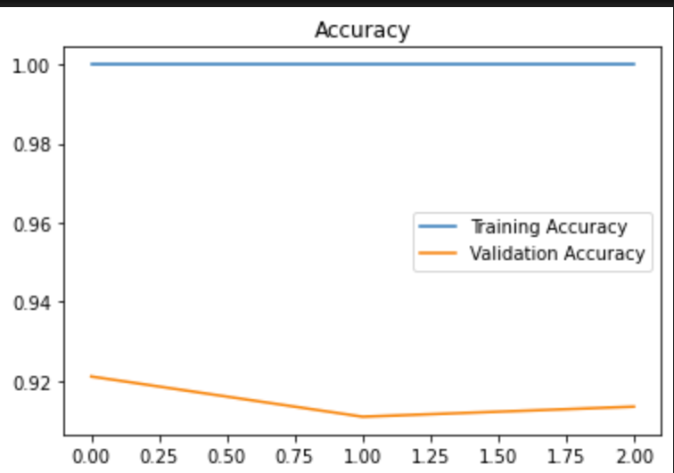

#  Brain Tumor Detection using CNNs and Data Augmentation

A complete deep learning pipeline for classifying MRI brain scans as **tumorous** or **non-tumorous**, built with **TensorFlow** and **Keras**.  
This project features a custom **Convolutional Neural Network (CNN)** architecture and a robust **data augmentation** process designed to improve accuracy and reduce overfitting when working with limited, imbalanced datasets.

> Dataset Source: [Brain MRI Images for Brain Tumor Detection (Kaggle)](https://www.kaggle.com/navoneel/brain-mri-images-for-brain-tumor-detection)

---

##  Repository Overview

This repository includes:
- Jupyter notebooks for data augmentation and CNN model training.
- Original and augmented MRI image datasets.
- Trained model checkpoints.
- TensorBoard logs for training and validation performance tracking.

### Folder Structure
```
.
├── Brain Tumor Detection.ipynb        # CNN model training and evaluation
├── Data Augmentation.ipynb            # Custom augmentation workflow
├── augmented data/                    # Generated augmented images
├── yes/                               # Original tumorous MRI images
├── no/                                # Original non-tumorous MRI images
├── logs/                              # TensorBoard logs
├── models/                            # Saved model checkpoints
└── README.md
```

---

## Getting Started
### Installation

Create a virtual environment and install the required dependencies:

```bash
python -m venv .venv
# Activate environment
# Windows PowerShell
. .venv/Scripts/Activate.ps1
# macOS/Linux
source .venv/bin/activate

pip install tensorflow keras numpy opencv-python matplotlib scikit-learn pillow
```

---

## Dataset Description

The dataset consists of MRI scans categorized into:
- `yes/`: Tumorous brain images  
- `no/`: Non-tumorous brain images  

**Original dataset:**
- 155 positive (tumorous) images  
- 98 negative (non-tumorous) images  
- **Total:** 253 images  

**After data augmentation:**
- 1085 positive + 980 negative = **2065 total images**  

All augmented images (including the original 253) are stored in the `augmented data/` directory.

---

##  Data Augmentation

### Why use augmentation?
The dataset was small and imbalanced, making augmentation crucial to improve model generalization and avoid overfitting.

### Techniques used:
- Random rotation, flipping, and zoom  
- Brightness and contrast adjustments  
- Scaling and shifting  
- Normalization (pixel values scaled between 0–1)

You can regenerate or modify the augmented data by running:
```
Data Augmentation.ipynb
```

---

## Preprocessing Steps

For every image:
1. **Crop** to isolate the brain region.  
2. **Resize** to a uniform shape `(240, 240, 3)`.  
3. **Normalize** pixel values to `[0, 1]`.  

### Data split:
- 70% → Training  
- 15% → Validation  
- 15% → Testing  

---

## Model Architecture

A simple yet effective CNN architecture designed for small medical image datasets.

**Architecture Overview:**
1. ZeroPadding2D  
2. Conv2D (32 filters, kernel size 7×7, stride 1)  
3. BatchNormalization  
4. ReLU Activation  
5. MaxPooling (4×4)  
6. Flatten  
7. Dense output layer with sigmoid activation  

### Why not transfer learning?
ResNet-50 and VGG-16 were tested initially but caused overfitting due to the small dataset size and limited hardware (Intel i7, 8 GB RAM).  
A smaller custom CNN was implemented to balance accuracy and computational efficiency.

---

## Model Training

- Trained for 24 epochs using early stopping to avoid overfitting.  
- Used TensorBoard to visualize accuracy and loss.  
- Best validation accuracy achieved near **epoch 23**.

### Launch TensorBoard
```bash
tensorboard --logdir logs
```

### Example Training Curves



---

## Results

| Metric | Validation | Test |
|--------|-------------|------|
| **Accuracy** | 0.91 | 0.89 |
| **F1 Score** | 0.91 | 0.88 |

> These results reflect balanced data performance after augmentation.  
> Slight variation is expected between runs due to random initialization.

---

## Model Checkpoints

All trained models are saved under `/models/`.

Example path:
```
models/cnn-parameters-improvement-03-0.92.model/
```

Load a saved model in Python:

```python
from tensorflow.keras.models import load_model

model = load_model('models/cnn-parameters-improvement-03-0.92.model')
```

---

##  Inference

Predict tumor presence from a preprocessed image:

```python
import cv2
import numpy as np

img = cv2.imread('test.jpg')
img = cv2.resize(img, (240, 240)) / 255.0
img = np.expand_dims(img, axis=0)

pred = model.predict(img)[0][0]
print("Tumor detected" if pred > 0.5 else "No tumor")
```

---

## Notes

Large files (augmented data, models, logs) may cause slow cloning.  
You can remove them or use **Git LFS** for better performance:

```bash
git lfs install
git lfs track "*.jpg" "*.png" "*.tfevents" "*.pb"
git add .gitattributes
git commit -m "Track large assets with Git LFS"
```

Example `.gitignore` entries:

```
augmented data/
logs/
models/
*.tfevents
*.pb
*.h5
*.ckpt*
*.zip
*.tar.gz
.DS_Store
```

---